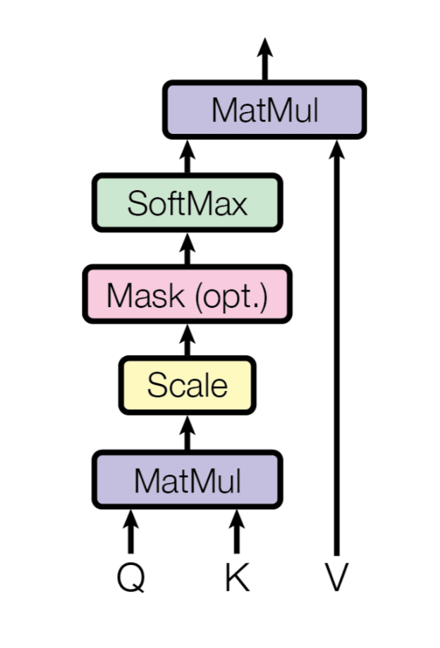
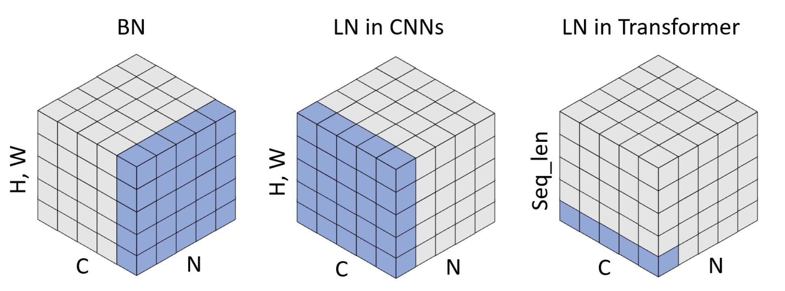

## CS 444: Deep Learning for Computer Vision, Fall 2024, Assignment 4

### Instructions

1. Assignment is due at **11:59:59 PM on Tuesday Nov 14 2024**.

2. See [policies](https://saurabhg.web.illinois.edu/teaching/cs444/fa2024/policies.html)
   on [class website](https://saurabhg.web.illinois.edu/teaching/cs444/fa2024).

3. Submission instructions:
    1. On gradescope assignment called `MP4-code`, upload the following  files:
        - Your completed `transformer_utils.py`. We will run tests to evaluate
          your pytorch code for `SelfAttention` and `LayerNorm` classes.
        - Predictions from your fine-tuned vision transformer
          (`test_predictions.txt`) from Question 2.  We will benchmark your
          predictions and report back the average accuracy. Score will be based
          on the accuracy of your predictions.
        - A single self-contained script called `script.py` that includes all the code to train and test the model that produced the test set results that you uploaded.

       Please also note the following points:
        - Do not compress the files into `.zip` as this will not work.
        - Do not change the provided files names nor the names of the functions
          but rather change the code inside the provided functions and add new
          functions. Also, make sure that the inputs and outputs of the
          provided functions are not changed.
        - The autograder will give you feedback on how well your code did.
        - The autograder is configured with the python libraries: `numpy
          absl-py tqdm torch torchvision` only.
    2. On gradescope assignment called `MP4-report`, upload the following
       - Training / validation plots and a description of what all you
         tried to get the detector to work and supporting control experiments.
         See Question 2.2 for more specific details.

4. Lastly, be careful not to work of a public fork of this repo. Make a private
   clone to work on your assignment. You are responsible for preventing other
   students from copying your work.

### Suggested Development Workflow
1. Question 1 can be worked upon locally without a GPU.
2. For Q2, where you have to actually train the model, you will need to use a serious GPU to train the model. We have arranged access to GPUs on the Campus Cluster for this purpose. See instructions here [doc](https://docs.google.com/document/d/1xdeSnUcaPfER2B7fE1SvcpbXQ8wKy-UBYreqLEzmw4w/edit?usp=sharing):
   - You should follow best practices in using the cluster (mentioned under section 5: **Campus Cluster Best Practices** in the instructions document), e.g. you should not request a job longer than 3 hours, should not queue more than 1 job at a time, not run anything on the root node etc. We (and the people who run the Campus Cluster) will be strictly monitoring usage patterns. Violating campus cluster policies may cause you to be banned from using it, and we will not be able to provide any help in that situation. So, please be careful.
   - If things go as planned, our calculations suggest that you should be able to get one 3 hour training run done per day on campus cluster. But please plan for additional time and don't wait till the last day to start traiing your models. 
   - You can also explore other training options as well, like [Kaggle](https://www.kaggle.com/code) and [Google Colab Pro](https://colab.research.google.com/signup). Your personal compute device may also have a decent enough GPU, check on that as well.
   


### Setup

   1. Install pre-requisites in `requirements.txt`
   2. **Download the dataset**: For Question 2, we will be working with a subset of [Flower102](https://www.robots.ox.ac.uk/~vgg/data/flowers/102/) containing 102 classes. 
      We work with subsets of train and valid splits contain 1600 and 800 images, respectively. If you are on a Unix-based system (macOS or Linux), you can run the following commands to download the dataset. If you are using Windows, you should manually download the dataset from [here](https://saurabhg.web.illinois.edu/teaching/cs444/fa2024/mp4/flower-dataset.zip) and extract the compressed file to the current directory. You should see a `flower-dataset-reduced` folder containing the dataset.
   ```bash
   wget https://saurabhg.web.illinois.edu/teaching/cs444/fa2024/mp4/flower-dataset-reduced.zip -O flower-dataset-reduced.zip
   unzip flower-dataset-reduced.zip
   ```

   Note: you should put the unziped `flower-dataset-reduced` folder under this MP directory and the `flower-dataset-reduced` folder layout should look like this

    .
    ├── train_data.pkl     # customed train set
    ├── val_data.pkl       # customed validation set
    └── test_data.pkl      # customed test set

   3. In the [dataset.py](./datasets.py), we provide the `get_flower102` function
      that streamlines the process of loading and processing your data during
      training. You are not allowed to modify this file. 

### Problems
In this programming assignment, we will (1) implement the attention and
layernorm operations using basic pytorch code, and (2) fine-tune a vision
transformer for image classification and possibly implement Visual Prompt Tuning
[(VPT)](https://arxiv.org/abs/2203.12119) to obtain the necessary accuracy for
full-credit. Q2 is independent from Q1, code you write for Q1 does not get used
for Q2.


1. **Implement Self Attention and Layer Norm**

   Complete the `SelfAttention` and `LayerNorm` classes in [transformer_utils.py](./transformer_utils.py). In this part, you will know how to write `SelfAttention` and `LayerNorm` classes. 

   1.1 [2 pts Autograded] We will implement the attention operation from the transformer paper ["Attention Is All You Need", Vaswani et al., 2017](https://arxiv.org/abs/1706.03762). The calculation of scaled dot-product attention is illustrated in the figure below:
   $$\text{Attention}(Q, K, V)=\text{softmax}\left(\frac{Q K^T}{\sqrt{d_k}}\right) V$$
   where $Q$ is the query matrix, $K$ is the key matrix, $V$ is the value matrix, and $d_k$ is the dimension of the key matrix.
   
   <div align="center">
   
   </div>

   Self-attention is a type of attention mechanism used in transformers. In self-attention, a model calculates the attention weights between each element in the input sequence, allowing it to focus on the relevant factors for a given task. The self-attention layer in ViT makes it possible to embed information globally across the overall image. Finish the implementation of self attention by following the instruction in class [SelfAttention](./transformer_utils.py#L5).

   You can test your `SelfAttention` implementation by running the following command. The test takes the input embeddings of shape `(batch_size, seq_len, hidden_dim)` as input, generate attention outputs of shape `(batch_size, seq_len, hidden_dim)`.

   ```bash
   python -m unittest test_functions.TestClass.test_self_attention -v 
   ```

   1.2 [2 pts Autograded] Layer normalization transforms the inputs to have zero mean and unit variance across the features. In this question, you will apply Layer Normalization over a mini-batch of inputs as described in the paper [Layer Normalization](https://arxiv.org/abs/1607.06450). The figure below shows the concept of Layer Norm (LN) in Transformer, which only calculates statistics in the channel dimension without involving the batch sequence length dimension.
   (image credit: [Leveraging Batch Normalization for Vision Transformers](https://openaccess.thecvf.com/content/ICCV2021W/NeurArch/html/Yao_Leveraging_Batch_Normalization_for_Vision_Transformers_ICCVW_2021_paper.html)).

   <div align="center">
   
   </div>
   
   When input embeddings $X \in \mathbb{R}^{B \times T \times C}$ is a batch of a sequence of embeddings, where $B$ is the batch size, $T$ is the length of the sequence, $C$ is the number of channels (hidden dimension). The learnable scales are $w \in \mathbb{R}^C$ and $b \in \mathbb{R}^C$. Layer normalization LN normalizes the input X as follows:
   $$\mathrm{LN}(X)=w \frac{X-{\mathbb{E}_C}[X]}{\sqrt{\text{Var}_C[X]+\epsilon}}+b$$
   
   You can test your `LayerNorm` implementation by running the following command. The test takes the 
   input embeddings of shape `(batch_size, seq_len, hidden_dim)` as input, generate normalized outputs of shape `(batch_size, seq_len, hidden_dim)`.

   ```bash
   python -m unittest test_functions.TestClass.test_layer_norm -v 
   ```
   
2. [4pts Autograded, 2pts Manually Graded] **Transfer Learning with Transformer**
   The starter code implements a linear classifier on top of a vision
   transformer. You can run this using the following command. Use the `--exp_name` flag to
   select the hyperparameters set in `config.yml` (You can change these when finetuning)
   The training loop also does validation once in a while and also saves train / val metrics into the output
   directory mentioned in `--outpur_dir`. This script saves the predictions on the test 
   set in a file called `test_predictions.txt` inside `{output_dir}/runs-{encoder}-flower102/demo-{exp_name}`.
   
   ```bash
   python demo_flower.py --exp_name vit_linear --output_dir run1 --encoder vit_b_32
   ```
   You can refer to [sample.sbatch](./sample.sbatch) script for running training job on the campus cluster.
   Since you will be performing multiple training runs, it is advised to maintain proper directory structure of your output folder.
   Refer to the following command to run your [sample.sbatch](./sample.sbatch) script.
   Variables `$OUTPUT_DIR` and Flags `--output`, `--error` should be changed for every subsequent run. Your log files (python terminal output) will be saved in `$OUTPUT_DIR/log.txt`. We created a python virtual environment and already downloaded the dataset for you to use on the campuscluter.
   Submitting jobs using the sbatch file that we provide should already use these.

    ```bash
    sbatch --export=ALL,OUTPUT_DIR="runs/run1/" --output="runs/run1/%j.out" --error="runs/run1/%j.err" sample.sbatch
    ```
   As per our implementation, this command took around 20 min to run on a A100 GPU on the campus cluster setup with 8s/it observed on average.
   Since training times heavily depend on implementation optimization, you may benefit from vectorizing your code.
   Refer to campus cluster instructions mentioned under **Suggested Development Workflow** for more details.


   Just doing this gives good performance already. Your goal is to improve the
   performance of this model by investigating alternate strategies for
   finetuning a vision transformer. You are welcome to try any strategy as long
   as you: a) stick to the data (and augmentations) that we provide, and b)
   stick to the pre-trained `vit_b_32` that we provide. We experimented with
   finetuning the full ViT backbone and shallow and deep versions of Visual
   Prompt Tuning (described below). We found Deep version of VPT to work the
   best and meet the accuracy threshold.  
   - [vision_transformer.py](./vision_transformer.py) describes the vision
     transformer architecture. You will work with `vit_b_32`.
   - [fine_tune.py](./fine_tune.py) describes the training loop and how we set
     up the linear layer on top of the ViT encoder. You are welcome to use as
     much or as little of this code.
    
   **Visual Prompt Tuning (VPT)**. The [Visual Prompt Tuning
   paper](https://arxiv.org/abs/2203.12119) introduces VPT as an efficient and
   effective alternative to full fine-tuning for large-scale Transformer models
   in vision. VPT introduces only a small amount of trainable parameters in the
   input space while keeping the model backbone frozen. You can experiment with
   VPT. We recommend to implement the VPT-Deep method introducted in the
   Section 3.2 in this paper, where prompts are introduced at every Transformer
   layer's input space. 

   The raw ViT with $N$ layers is formulated as:
   $[\mathbf{c}_i, \mathbf{X}_i] =L_i ([\mathbf{c}_{i-1}, \mathbf{X}_{i-1}])$. 
   Classification is done via: $\mathbf{y} =\text{Head}\left(\mathbf{c}_N\right)$ 
   where $\mathbf{c}_i \in \mathbb{R}^d$ denotes [CLS]'s embedding and 
   $\mathbf{X}_i$ denotes the set of features for the different tokens in the
   image as output by the $i^{th}$ layer $L_{i}$.

   Now with VPT-Deep, for $(i+1)$-th Layer $L_{i+1}$, we denote the collection
   of input learnable prompts as $\mathbf{P}_i=\left\{\mathbf{p}_i^k \in
   \mathbb{R}^d \mid k \in \mathbb{N}, 1 \leq k \leq m\right\}$ and concatenate
   the prompts with the embeddings on the sequence length dimension. The
   deep-prompted ViT is formulated as:
   $${\left[\mathbf{c}_i, \ldots, \mathbf{X}_i\right] } =L_i ([\mathbf{c}_{i-1}, \mathbf{X}_{i-1} \mathbf{P}_{i-1}]),$$

   $$\mathbf{y} =\text{Head}\left(\mathbf{c}_N\right)$$

   $\mathbf{P}_i$'s are learnable parameters that are trained via back-propagation. 


   **Implementation Hints**: If you decide to implement deep Visual Prompt
   Tuning, here are some implementation notes that may be useful. You could
   create a new class in `finetune.py` that stores the ViT backbone and the
   learnable prompts via `nn.Parameter(torch.zeros(1, num_layers, prompt_len,
   hidden_dim))`. The `hidden_dim` of the prompt is the same as the `hidden_dim` of the transformer encoder, and they are both `768` in our implementation. The forward function passes these prompts along with the
   input $x$ to the ViT encoder. You will also need to modify the ViT encoder
   to accomodate prompts at each layer. Thus, you may also need to modify the
   the `forward` function of the `Encoder` class in the `vision_transformer.py`
   file.

   **Suggested Hyperparameters**: We found the following hyper-parameters to
   work well: 10 prompts per layer, prompts were initialized using weights
   sampled uniformly from $[-v, v]$ where $v^2 = 6/(\text{hidden dim} +
   \text{prompt dim})$, `SGD` optimizer with a learning rate of `0.01`, weight
   decay of `0.01`, training for `100` epochs with learning rate being dropped
   by a factor of 10 at epoch 60 and 80. The hyperparameters that are set 
   in the code right now will not give good performance.
   
   You can evaluate this development on the validation set. For the validation
   run with the best performance, upload the predictions on the test set to
   gradescope.

   **2.1** Upload the `test_predictions.txt` file to Gradescope
   to obtain its performance on the test set. It will be scored based on the
   accuracy it obtains. This is the autograded part. Submissions with an
   accuracy of **`0.92`** or higher will receive full credit.

   **2.2** For the manually graded part:
   - Include snapshots for the training and validation plots from tensorboard
     for your best run.
   - Document the hyperparameters and/or improvement techniques you applied in
     your report and discuss your findings. Include control experiments that
     measure the effectiveness of each aspect that lead to large improvements.
     For example, if you are trying to improve the performance of your model by
     trying different vision transfromer backbones, you should include a control
     experiment that measures the performance of the model using different backbones. 
     It is insightful to do backward ablations: starting with your final model, 
     remove each modification you made one at a time to measure its contribution to 
     the final performance. Consider presenting your results in tabular form along
     with a discussion of the results.
